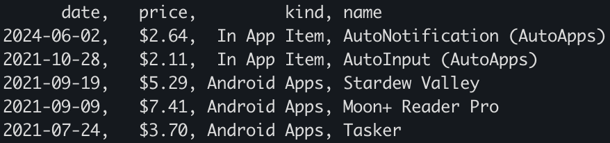

# Introduction
`google-play-purchases` is a tool for exporting a list of your purchases from google's play store (since there's not a great way to do this normally). It reads from a google takeout file and produces a csv.

# Steps
1. visit [google takeout](https://takeout.google.com)
2. select "Google Play Store" to export
3. finish the export and download the file
4. run `google-play-purchases 'takeout-[timestamp].zip'`
5. see `purchases.csv`

# Usage
`google-play-purchases [path to takeout zip]`

# Output
`google-play-purchases` writes to stdout and `purchases.csv` in the following format:

